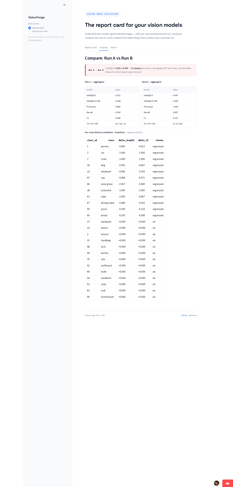

<p align="center">
  
  
  
  
</p>

<h1 align="center">VisionForge</h1>
<p align="center"><em>The report card for your vision models.</em></p>

<p align="center">
  <a href="#what-is-this"><strong>What is this</strong></a> ·
  <a href="#how-it-works"><strong>How it works</strong></a> ·
  <a href="#quick-start"><strong>Quickstart</strong></a> ·
  <a href="#the-regression-view"><strong>The regression view</strong></a> ·
  <a href="#metrics"><strong>Metrics</strong></a> ·
  <a href="#who-is-this-for"><strong>Who is this for</strong></a> ·
  <a href="SPEC.md"><strong>Spec</strong></a> ·
  <a href="ARCHITECTURE.md"><strong>Architecture</strong></a>
</p>

---

## What is this?

**VisionForge grades detection models against labeled images — and shows when a new model version makes them worse.**

Object detection models output bounding boxes with confidence scores. The question is always: *how good are those boxes?* VisionForge answers it the same way the COCO benchmark does: compare every prediction against ground truth, count true positives, false positives (drew a box where nothing is), and false negatives (missed a real object), and turn the counts into a report card.

The special feature is the **regression view**: grade the same images with the old model and the new model, and VisionForge tells you which object types got *worse* — before your customers see it.

- **Detector-agnostic** — works with predictions from YOLO, DETR, R-CNN, or anything that exports COCO-format JSON
- **Pure Python + numpy core** — no torch, no GPU, no Cython; runs anywhere
- **CI-ready** — `--fail-on-regression` exits non-zero when a run regressed, so a bad release fails the build
- **Deterministic and reproducible** — same inputs, byte-identical report

<div align="center">
  
  <p><em>The regression view: 12 classes got worse when the model config changed.</em></p>
</div>

---

## How it works

```
  1. LABEL          2. RUN              3. GRADE
  ─────────────     ──────────────      ──────────────
  Ground truth =    Your detector      VisionForge compares
  a human-drawn     produces boxes     every box against GT,
  answer key        with confidence    counts TP/FP/FN, and
  (COCO JSON)       scores (COCO JSON) produces the report card
```

- **You provide the answer key** — COCO-style ground truth JSON (images, annotations, categories)
- **Your model provides its guesses** — COCO-style results JSON (image_id, category_id, bbox, score)
- **VisionForge does the grading** — greedy IoU matching per class (validated against pycocotools), COCO protocol metrics, and a per-image failure table

No model training, no API keys, no external calls. The demo runs entirely in your browser.

---

## Quick Start

```bash
# Install (core CLI + UI)
pip install -e ".[ui]"

# Evaluate one run — writes report.json + report.md
visionforge evaluate --gt examples/gt_sample.json --preds examples/preds_run_a.json

# Compare two runs — the regression view
visionforge compare --gt examples/gt_sample.json \
    --base examples/preds_run_a.json \
    --candidate examples/preds_run_b.json --fail-on-regression
# → verdict: REGRESSED (exit code 1)

# Launch the dashboard
streamlit run visionforge/ui/app.py
```

The repo ships a real demo: 12 COCO val2017 images with ground truth, plus two YOLOv8n prediction runs (confidence 0.25 vs 0.90). Run the commands above and you get real numbers — mAP@0.5 0.315 for run A, 0.047 for run B, verdict REGRESSED.

For the dashboard's upload flow, the repo also ships a simulated "v2" kit derived from the real run-A output (`data/generate_upload_demo.py`):
- `examples/preds_v2_mixed.json` — person regresses (−0.146) while dining table improves (+0.743): aggregate mAP actually rises 0.315 → 0.338 as a class breaks (the "mAP hides it" story)
- `examples/preds_v2_clean.json` — only improvements → verdict PASS, "clean release" banner

## The regression view

Run A vs run B on the same ground truth:

| Class | Delta mAP@0.5 | Status |
|-------|---------------|--------|
| person | -0.409 | regressed |
| car | -1.000 | regressed |
| dog | -0.505 | regressed |
| dining table | -0.089 | regressed |
| ... | | |
| chair | +0.000 | ok |

A class regresses when its mAP@0.5 delta drops below `-0.05` (strict `<`, so exactly -0.05 does not flag). Classes present in only one run are reported as `n/a` — never silently zero.

## Web dashboard

`streamlit run visionforge/ui/app.py` (or the [live app](https://visionforge-sxbb3ltfcuftm66zfzvgkx.streamlit.app/)) — three tabs:

- **Report card** — full per-run card: hero metrics, per-class table, IoU histogram, confusion matrix, per-image detail. When two runs are loaded (sample or upload) both cards appear as nested tabs.
- **Compare** — verdict banner, aggregate side-by-side, and the per-class delta table with regressed/improved badges. Full report cards live in the Report card tab.
- **About** — input formats and CLI examples.

The built-in "Sample demo" is the real YOLOv8n pair above (Run A = conf 0.25, Run B = conf 0.90). The upload flow accepts the same formats and renders the same views.

## Metrics

All metrics follow the COCO evaluation protocol (Lin et al., 2014), implemented independently in numpy and cross-checked against pycocotools:

- **mAP@0.5** — mean average precision at IoU 0.5 (the "does it find objects" score)
- **mAP@0.5:0.95** — averaged over 10 IoU thresholds (the "how precise are the boxes" score)
- **Precision / Recall / F1** at IoU 0.5
- **Per-class** versions of all of the above
- **IoU distribution** of matched detections (p50/p90, histogram)
- **Confusion matrix** with background row/column — catches phantom-object failures that mAP hides
- **Per-image TP/FP/FN** — which images are hardest

## Input format (COCO-style)

Ground truth:
```json
{
  "images": [{"id": 1, "file_name": "img1.jpg", "width": 640, "height": 480}],
  "annotations": [{"id": 1, "image_id": 1, "category_id": 1, "bbox": [10, 10, 50, 40]}],
  "categories": [{"id": 1, "name": "person"}]
}
```

Predictions (bare COCO results list, or `{"predictions": [...]}`):
```json
[{"image_id": 1, "category_id": 1, "bbox": [10, 10, 50, 40], "score": 0.87}]
```

Bounding boxes are `[x, y, width, height]`. `visionforge info` prints this schema.

## Who is this for?

- **ML/AI engineers** shipping detection models — prove quality, catch regressions between versions
- **Computer vision teams** — CI gate for model releases (`--fail-on-regression`)
- **Founders** building vision products (QC, surveillance, retail) — know when a model update breaks things
- **Freelancers** doing detection integration — show clients measurable before/after quality
- **Students** learning detection evaluation — read a clean numpy implementation of the COCO protocol

## Explicitly out of scope (v1)

- No training or fine-tuning
- No tracking / MOT metrics (v2 extension)
- No annotation tooling (GT is an input file)
- No video processing (v2 extension)
- No API keys, no cloud dependencies in the core

---

MIT licensed. Built with numpy, pydantic, typer, and Streamlit. Methodology follows the COCO evaluation protocol; independent implementation, no Ultralytics or pycocotools code.
